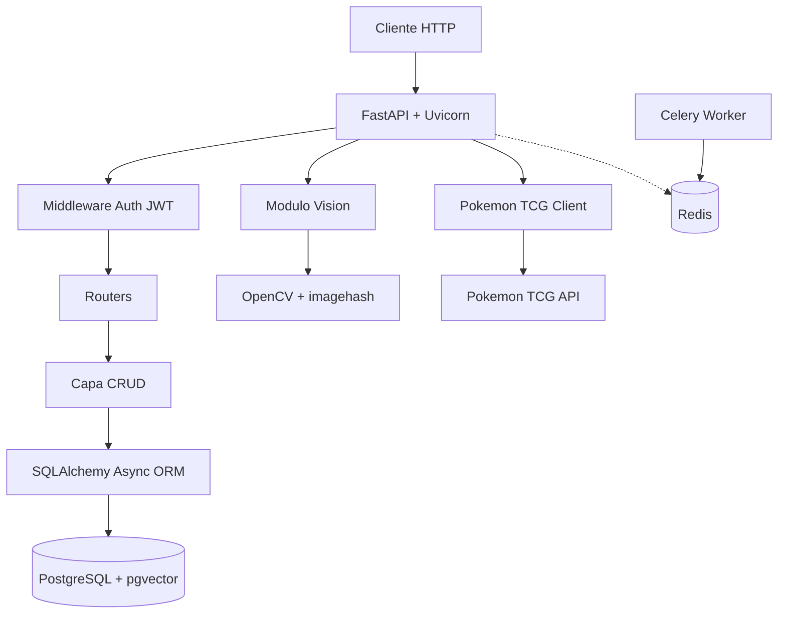
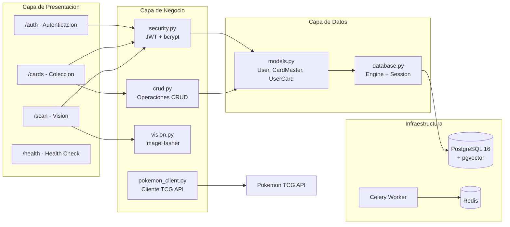
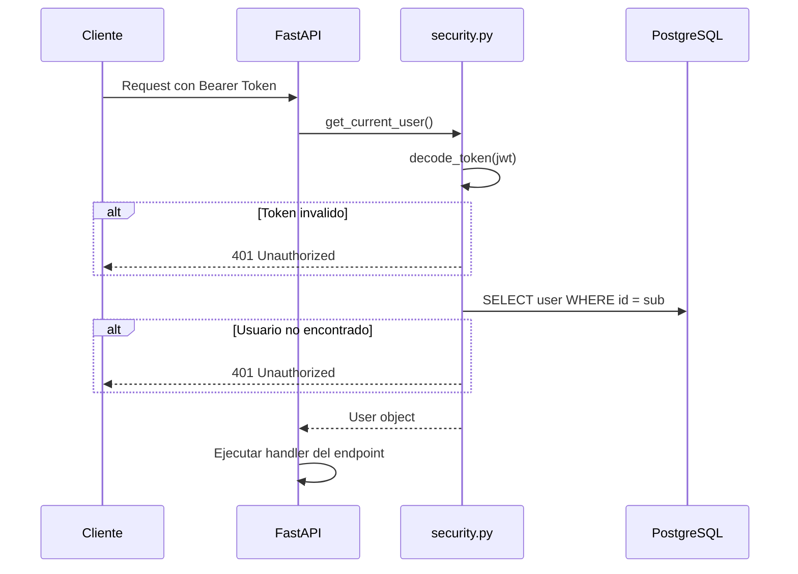
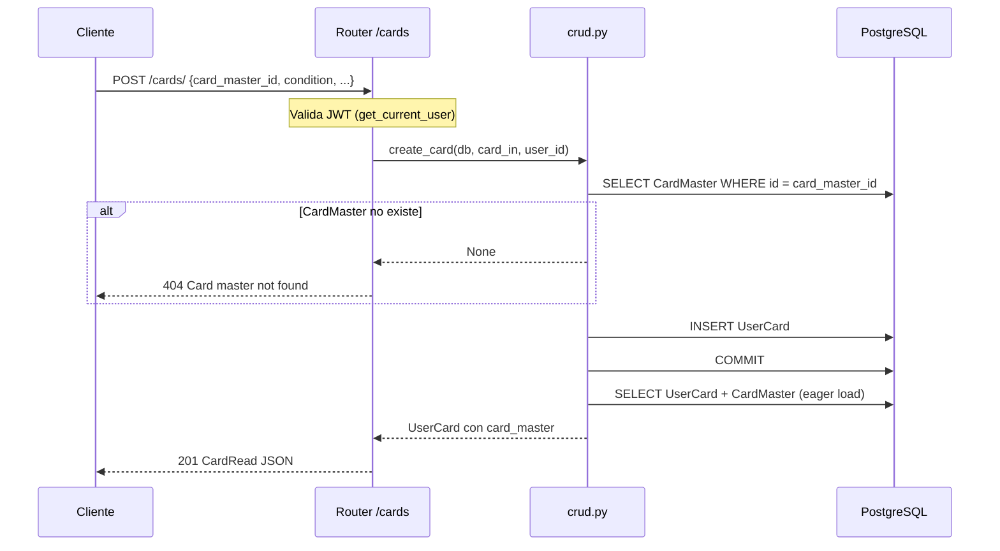
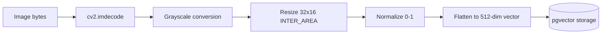
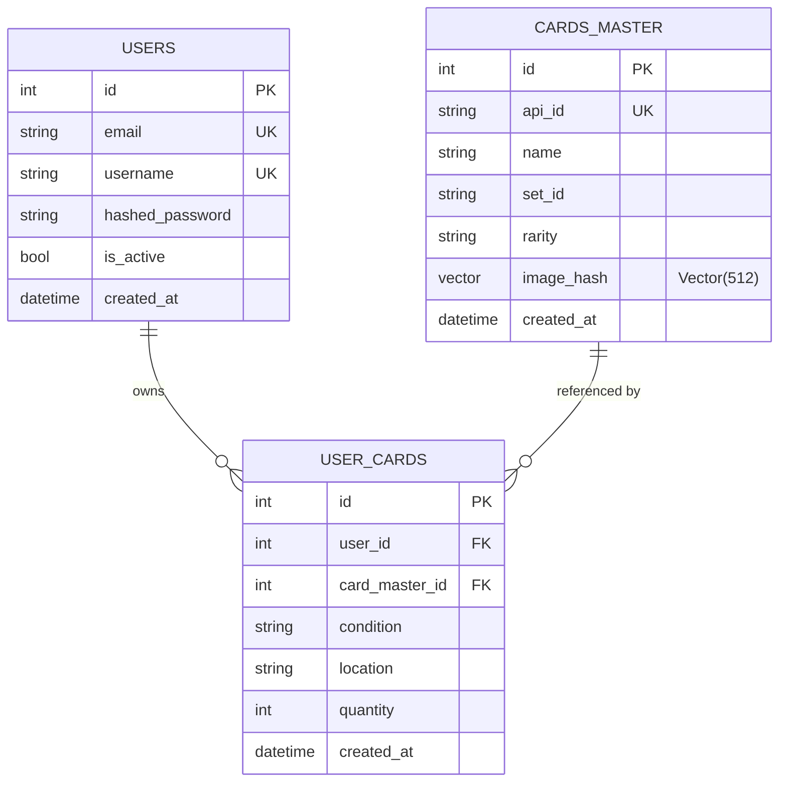

# Arquitectura del Proyecto

Documentacion tecnica de la arquitectura, patrones de diseno y decisiones tecnicas de PokeScan DB.

---

## Tabla de Contenidos

- [Vision general](#vision-general)
- [Diagrama de arquitectura](#diagrama-de-arquitectura)
- [Estructura de directorios](#estructura-de-directorios)
- [Capas y modulos](#capas-y-modulos)
- [Flujo de datos](#flujo-de-datos)
- [Modelo de datos](#modelo-de-datos)
- [Patrones de diseno](#patrones-de-diseno)
- [Decisiones de arquitectura](#decisiones-de-arquitectura)

---

## Vision general

PokeScan DB es una API REST construida con **FastAPI** que sigue una arquitectura en capas con separacion clara de responsabilidades. La aplicacion es **async end-to-end**, desde el framework web hasta las queries a la base de datos.



---

## Diagrama de arquitectura

### Arquitectura de componentes



### Flujo de autenticacion



---

## Estructura de directorios

```
pokescan-db/
├── src/                          # Codigo fuente principal
│   ├── __init__.py               # Marca src como paquete Python
│   ├── main.py                   # Entry point: FastAPI app + registro de routers
│   ├── database.py               # Engine async, session factory, Base ORM
│   ├── models.py                 # Modelos ORM: User, CardMaster, UserCard
│   ├── constants.py              # Constantes globales (VECTOR_DIM)
│   ├── schemas.py                # Schemas Pydantic de request/response
│   ├── security.py               # Autenticacion: JWT, bcrypt, dependencia FastAPI
│   ├── vision.py                 # Hashing perceptual de imagenes
│   ├── pokemon_client.py         # Cliente async para Pokemon TCG API
│   ├── crud.py                   # Operaciones CRUD sobre la coleccion
│   ├── worker.py                 # Configuracion de Celery + Redis
│   └── routers/                  # Sub-paquete de routers
│       ├── __init__.py
│       └── collection.py         # Endpoints CRUD de /cards
│
├── tests/                        # Suite de tests
│   ├── conftest.py               # Fixtures compartidos (db_session, client, etc.)
│   ├── test_db.py                # Tests de conexion PostgreSQL + pgvector
│   ├── test_db_setup.py          # Tests de SQLAlchemy async
│   ├── test_security.py          # Tests de hashing y JWT
│   ├── test_infra.py             # Tests de Redis y Celery
│   ├── test_pokemon_client.py    # Tests del cliente Pokemon TCG
│   ├── test_vision.py            # Tests de ImageHasher
│   ├── test_models.py            # Tests de modelos ORM
│   ├── test_auth.py              # Tests de endpoints de auth
│   ├── test_crud.py              # Tests de operaciones CRUD
│   ├── test_api_collection.py    # Tests de API de coleccion
│   ├── test_router_registration.py  # Tests de registro de routers
│   ├── test_e2e_flow.py          # Tests end-to-end
│   └── test_health.py            # Test de health check
│
├── alembic/                      # Migraciones de base de datos
│   ├── env.py                    # Configuracion del entorno de migracion
│   ├── script.py.mako            # Template de migraciones
│   └── versions/                 # Archivos de migracion
│       ├── c10345f90d5a_create_users_table.py
│       ├── a7b3c8d2e1f4_create_cards_master_table.py
│       ├── b8c4d9e3f2a5_update_card_master_vector_dim.py
│       └── 20260321_create_user_cards.py
│
├── docker-compose.yml            # Servicios: PostgreSQL + Redis
├── init.sql                      # Script de inicializacion (extension pgvector)
├── alembic.ini                   # Configuracion de Alembic
├── requirements.txt              # Dependencias Python
├── .env.example                  # Plantilla de variables de entorno
└── .gitignore                    # Reglas de exclusion de Git
```

---

## Capas y modulos

### Capa de presentacion (Routers)

| Modulo | Prefijo | Responsabilidad |
|---|---|---|
| `security.py` | `/auth` | Registro e inicio de sesion |
| `routers/collection.py` | `/cards` | CRUD de coleccion de cartas |
| `vision.py` | `/scan` | Procesamiento de imagenes |
| `main.py` | `/health` | Health check |

Los routers solo se encargan de:
- Validar la entrada (delegado a Pydantic)
- Llamar a la capa de negocio
- Formatear la respuesta HTTP

### Capa de negocio

| Modulo | Responsabilidad |
|---|---|
| `crud.py` | Logica CRUD de coleccion (queries, validaciones de negocio) |
| `security.py` | Hashing de contrasenas, generacion/validacion de JWT |
| `vision.py` | Conversion de imagenes a vectores y hashes perceptuales |
| `pokemon_client.py` | Comunicacion con la API externa de Pokemon TCG |

### Capa de datos

| Modulo | Responsabilidad |
|---|---|
| `database.py` | Configuracion del engine async, session factory, Base ORM |
| `models.py` | Definicion de modelos ORM con relaciones |
| `constants.py` | Constantes compartidas (evita dependencias circulares) |
| `schemas.py` | Schemas de validacion Pydantic |

### Capa de infraestructura

| Servicio | Tecnologia | Proposito |
|---|---|---|
| Base de datos | PostgreSQL 16 + pgvector | Almacenamiento persistente + busqueda vectorial |
| Cache/Broker | Redis Alpine | Broker de mensajes para Celery |
| Worker | Celery | Tareas asincronas en segundo plano |

---

## Flujo de datos

### Crear una carta en la coleccion



### Procesamiento de imagen (flujo interno)



---

## Modelo de datos

### Diagrama entidad-relacion



### Relaciones

- **User** `1:N` **UserCard**: Un usuario puede tener muchas cartas en su coleccion
- **CardMaster** `1:N` **UserCard**: Una carta maestra puede estar en multiples colecciones
- **Cascade delete**: Al eliminar un User o CardMaster, se eliminan los UserCard asociados

---

## Patrones de diseno

### Single Responsibility Principle (SRP)

Cada modulo tiene una unica responsabilidad claramente definida:
- `crud.py` solo contiene logica de base de datos
- `security.py` solo contiene logica de autenticacion
- `vision.py` solo contiene logica de procesamiento de imagenes
- Los routers solo coordinan entre capas

### Dependency Injection (FastAPI Depends)

```python
async def get_current_user(
    credentials = Depends(security_scheme),
    db: AsyncSession = Depends(get_db),
): ...
```

FastAPI inyecta automaticamente la sesion de BD y las credenciales en cada handler.

### Repository Pattern (crud.py)

El modulo `crud.py` actua como repositorio, encapsulando todas las queries de base de datos y exponiendo una interfaz limpia a los routers.

### Zero Hardcoding (P2)

Todas las configuraciones se leen de variables de entorno con valores por defecto sensatos:

```python
SECRET_KEY = os.environ.get("SECRET_KEY", "replace_me_with_a_random_secret")
DATABASE_URL = os.getenv("DATABASE_URL", "postgresql+asyncpg://...")
```

### Determinismo (P6)

El procesamiento de imagenes usa parametros fijos para garantizar resultados reproducibles:
- Interpolacion: `cv2.INTER_AREA`
- Espacio de color: `cv2.COLOR_BGR2GRAY`
- Dimensiones: 32x16 (constantes de clase)

### Idempotencia (P9)

La misma imagen de entrada siempre produce el mismo vector y hash perceptual.

### Retry con backoff exponencial

El cliente de Pokemon TCG reintenta automaticamente en caso de rate limit (429) o errores de servidor (5xx):

```
Intento 1 → fallo → espera 1s
Intento 2 → fallo → espera 2s
Intento 3 → fallo → lanza excepcion
```

---

## Decisiones de arquitectura

### Async end-to-end

**Decision:** Usar async/await en todas las capas (FastAPI, SQLAlchemy, httpx, asyncpg).

**Justificacion:** Maximiza el throughput en operaciones I/O-bound (queries a BD, llamadas HTTP externas) sin necesidad de threads adicionales.

### pgvector para busqueda visual

**Decision:** Almacenar vectores de 512 dimensiones directamente en PostgreSQL via pgvector.

**Justificacion:** Evita la complejidad de un servicio de busqueda vectorial separado (como Pinecone o Milvus). Para el volumen esperado de cartas Pokemon (~20,000 cartas unicas), pgvector ofrece rendimiento suficiente con la ventaja de mantener todo en un solo motor de base de datos.

### Vector de 512 dimensiones

**Decision:** Usar un vector de 32x16 = 512 dimensiones para representar imagenes.

**Justificacion:** Balance entre precision de similitud y costo de almacenamiento. Se inicio con 64 dimensiones y se escalo a 512 tras validar que mejoraba significativamente la precision sin impacto notable en rendimiento.

### ORJSONResponse para sync

**Decision:** El endpoint `/cards/sync` usa `ORJSONResponse` en lugar del serializador JSON estandar.

**Justificacion:** Para colecciones grandes, orjson serializa listas de enteros significativamente mas rapido que el `json` estandar de Python.

### Celery + Redis preparado

**Decision:** Configurar Celery y Redis desde el inicio aunque no haya tareas registradas.

**Justificacion:** La infraestructura de tareas en segundo plano es necesaria para funcionalidades planeadas como ingesta masiva de cartas y procesamiento batch de imagenes. Configurarla desde el inicio evita refactoring posterior.

### constants.py como modulo ligero

**Decision:** Aislar `VECTOR_DIM` en un modulo sin dependencias pesadas.

**Justificacion:** Evita importaciones circulares. `constants.py` puede ser importado por `models.py`, migraciones de Alembic y `vision.py` sin arrastrar OpenCV o SQLAlchemy.
